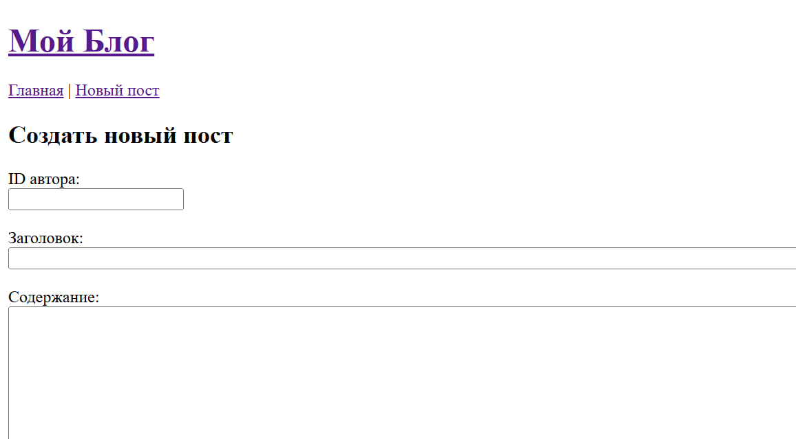
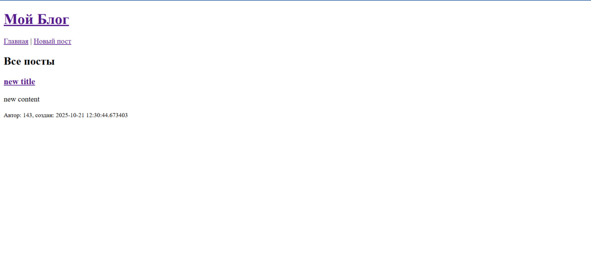
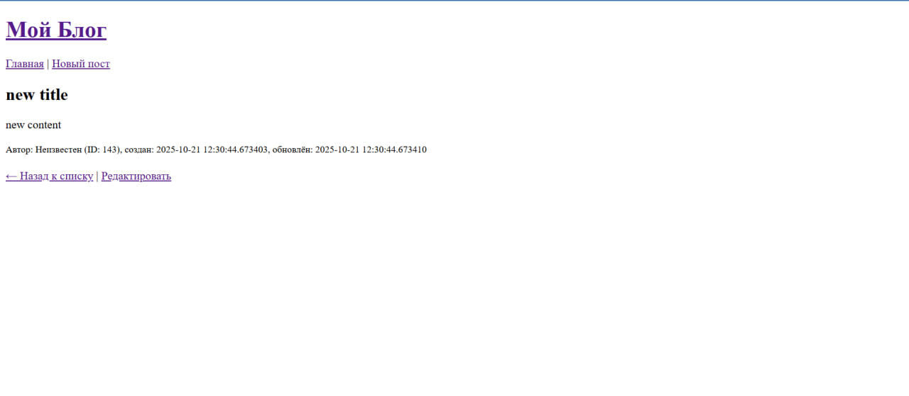
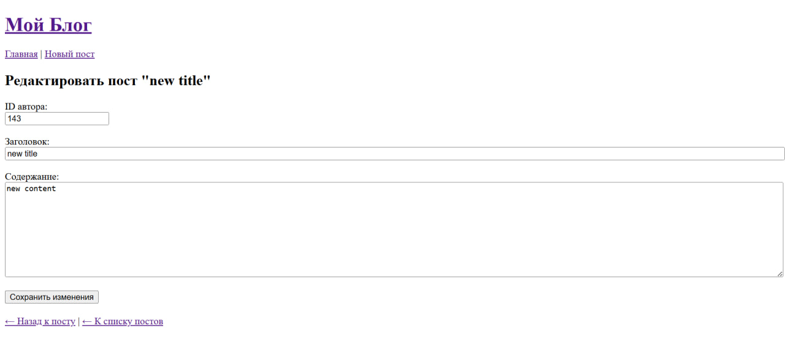

# blogWeb
 Главная страница без постов
 создать новый пост
 главная страница с постом
 просмотр поста
 редактировать пост

выполненные требования:
Смена темы сайта (светлая, тёмная и системная) 
Адаптивность под мобильные устройства
Хранение данных в БД 
Контейнеризация 
CRUD-операции для всех сущностей
Валидация входных данных и обработка ошибок 
Авторизация и контроль доступа 
Пагинация и фильтрация постов и пользователей 
Использование кэширования 
Полнотекстовый поиск постов 
Ролевая система контроля доступа
Тестирование
Написаны unit и интеграционные тесты
Регистрация, аутентификация и страницы регистрации и входа
Страница профиля пользователя с возможностью редактирования информации собственного аккаунта
Главная страница с лентой постов
Страница создания поста
Возможность поиска постов по заголовку и тексту
Возможность поиска пользователей
Возможность сохранять и просматривать избранные посты 
Валидация данных форм 
Обработка серверных ошибок 
Тестирование
Написаны unit и компонентные тест
Написаны E2E-тесты, покрывающие базовые сценарии работы с системой 

[//]: # (dfvklsn;dhcb)